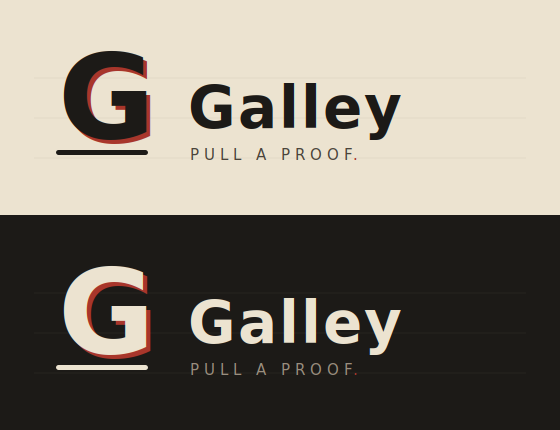
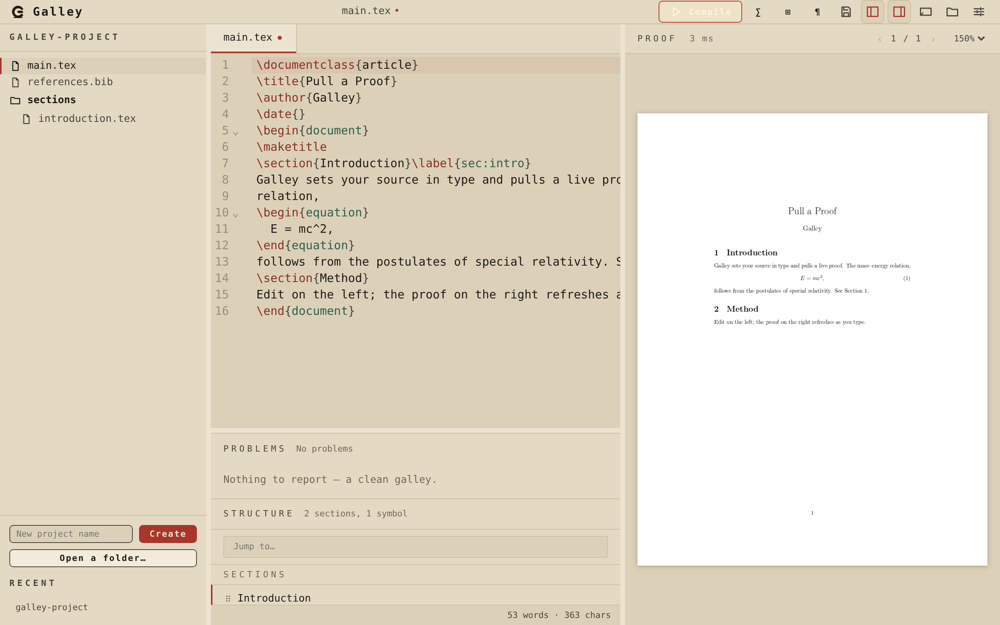
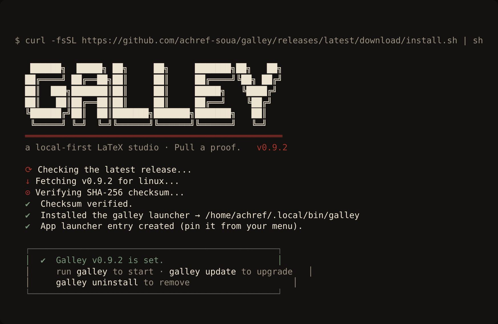
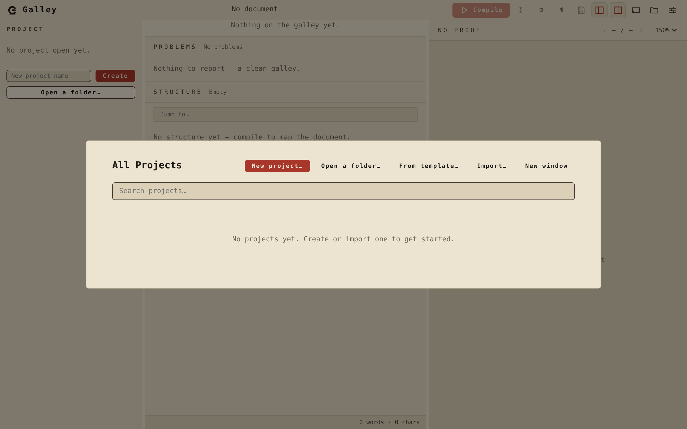
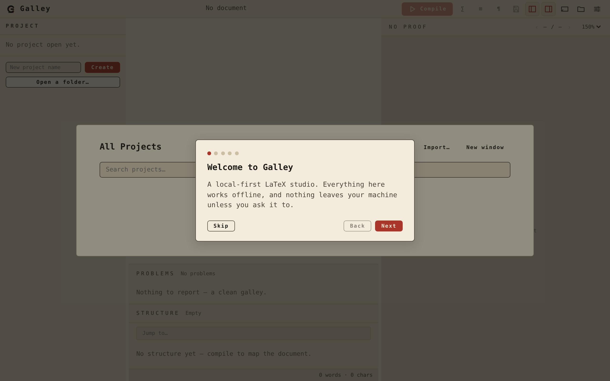
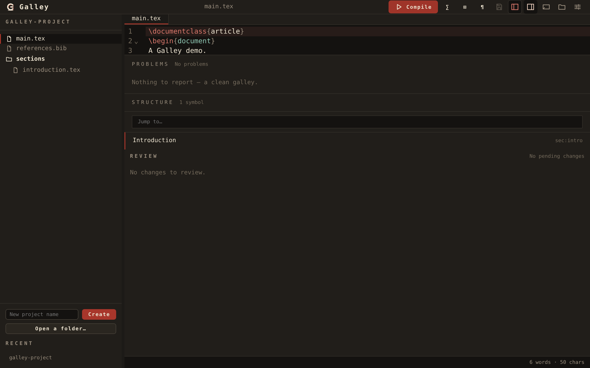
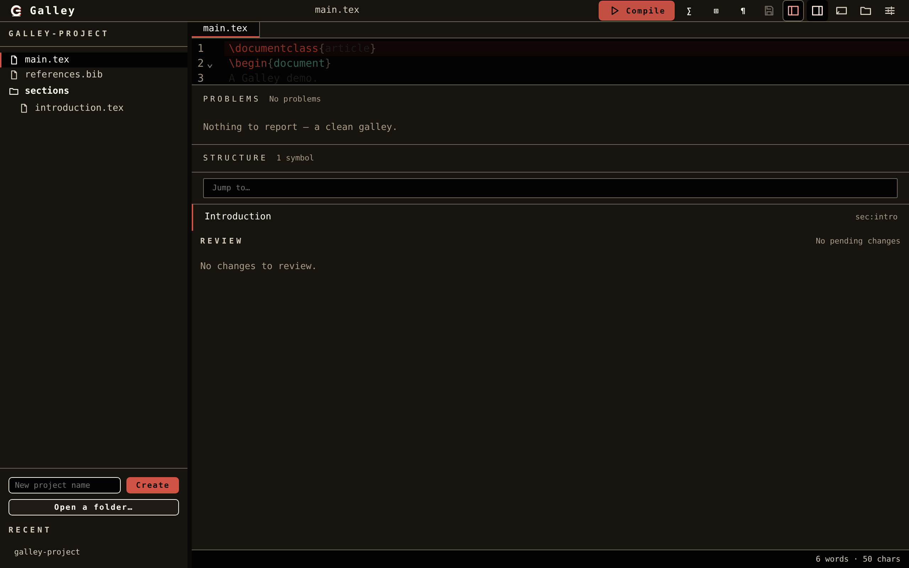
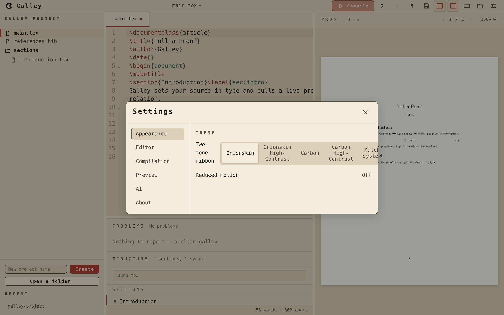

<div align="center">
  

  <p><strong>A local-first, blazing-fast LaTeX studio. Pull a proof.</strong></p>

  <p>
    
    
    
    
  </p>

  <p>
    
  </p>

  <p><em>▶ Watch the <a href="docs/assets/galley-demo.webm">demo walkthrough</a>.</em></p>
</div>

---

Galley is what a great LaTeX editor should feel like: **local, instant, private, and
beautiful**. A power-user code editor and a Word-like visual editor are two views of the
_same_ `.tex` source. Live preview. A provider-agnostic AI collaborator you fully control.
And a one-click path to bring your existing projects in. It produces **every** kind of
LaTeX document — papers, theses, books, CVs, slides, posters, letters, and more.

The interface borrows from a fine mechanical typewriter: a two-tone black-and-red ribbon,
a monospace impression struck into warm paper, restrained and tactile.

> **Status — release candidate.** This is `v0.9.1`: the **release candidate** with generated
> screenshots and a demo recording, complete documentation, and a recorded performance & security
> sign-off.
> The full product is in place — the warm, incremental CodeMirror 6 + **Tectonic** + **PDF.js**
> core; structured diagnostics and TexLab language intelligence; the dual code/visual editor; math,
> tables, assets, and bibliography; the provider-agnostic AI assistant and agents; git-backed
> version history; Overleaf/arXiv import and clean export; a template gallery; security hardening;
> performance budgets; four accessible themes with i18n and onboarding; opt-in crash reporting; and
> native installers for Windows, macOS, and Linux. A full QA pass and v1.0.0 follow.

## Install

One command — it downloads the right native build, verifies its checksum, installs a `galley`
launcher, and adds the menu icon:

```sh
# Linux / macOS
curl -fsSL https://github.com/achref-soua/galley/releases/latest/download/install.sh | sh
```

```powershell
# Windows
irm https://github.com/achref-soua/galley/releases/latest/download/install.ps1 | iex
```



Then `galley` launches it, **`galley update`** upgrades to the latest, `galley version` prints the
installed version, and **`galley uninstall`** removes it (your projects are untouched). Galley also
checks for updates on launch and offers them in-app (toggle in Settings → About). Full details in
[`docs/install.md`](docs/install.md).

## A look around

|                                                |                                                       |
| ---------------------------------------------- | ----------------------------------------------------- |
|  |          |
|  |     |
|           |  |

> Screenshots are generated from the live UI with `just screenshots`, and the demo with
> `just demo`, so they never go stale. (The web preview shows a placeholder proof; the packaged
> app renders the real compiled PDF.)

## Editing & compiling

The editor is CodeMirror 6 over the canonical `.tex` source — there is no parallel model.
Galley compiles that buffer directly with an embedded Tectonic engine and renders the PDF in
the preview pane; a failed build shows its log instead. Compilation is **incremental and
warm**: one long-lived engine reuses Tectonic's cached format and bundle, and an in-memory
content cache returns the previous proof unchanged when nothing changed — so a cached
single-edit recompile is sub-second. It runs **as you type** (debounced, and stale builds are
dropped), or on demand with **Compile** / `Ctrl`/`⌘`+`B`; the preview keeps the last good
proof on screen rather than flickering, shows the build time, and can ring a bell on success
(off by default — Settings → Compilation). Saving stays a separate, explicit action. Tectonic
fetches its package bundle once and caches it, so after a single `just prewarm` (or first
online compile) every later compile works **fully offline**.

## Errors & guidance

When a build fails you get help, not a transcript. Galley parses the TeX log into structured
**diagnostics** — errors, warnings, and bad boxes — and surfaces them three ways: a coloured
**dot in the editor gutter** beside each affected line, a **problems panel** under the editor
that lists them worst-first, and a **click that jumps** the cursor to the offending line. Each
entry pairs the raw message with a **plain-language explanation and fix tip** in Galley's
voice — _"A brace was opened and never closed…"_ rather than _"Paragraph ended before…"_. It
knows the common offenders: undefined commands, `Missing $`, unclosed braces and environments,
missing files, package errors, undefined references and citations, and overfull/underfull
boxes. The raw log is still there in the preview when you want it.

## Language intelligence

Galley speaks LaTeX through the **TexLab** language server, kept warm in process. As you type you
get context-aware **completion** — commands, environments, packages, document classes, `\ref`
labels, `\cite` keys, and file paths — each with the right icon and insertion. **Hover** a symbol
for help, press `F12` to **jump to a definition** (a `\ref` to its `\label`, a `\cite` to its
entry — **across files** in a multi-file project). The server's **diagnostics** (ChkTeX style
notes and TexLab's own analysis) are merged into the same gutter and problems panel as the
compile-log ones. All of the protocol and mapping is pure, covered Rust; the live `texlab` process
sits behind a feature seam (like the compile engine), and the editor degrades gracefully when it
is absent. _(`texlab` is a host requirement for the packaged app — install it with
`cargo install --locked texlab`.)_

## Structure & multi-file navigation

The **structure sidebar** shows the open document's include tree — every `\input{}`, `\include{}`,
and `\subfile{}` reference parsed live from the editor buffer — and the structural outline from
TexLab (sections and environments). A **jump-to-anything** search input at the top filters both
sections simultaneously; clicking an include opens the file, clicking a symbol scrolls to it.

Multi-file projects compile correctly out of the box: when the active file is included by a root
document, Galley sends the **root** to Tectonic, so the proof always reflects the whole document.
The root is detected from the project manifest (`project.toml`) and can be set in the project
settings.

## Projects

A project is just a folder. **New project** scaffolds one with a starter `main.tex`;
**Open a folder** imports any existing LaTeX directory in place — Galley scans it, detects
the root document, and adds a single `.galley/project.toml` manifest that never affects
compilation and can be deleted at any time. Files open and save with a dirty marker, and a
guard catches unsaved edits before you switch away. Everything stays inside the project
root: a sandboxed file store refuses absolute paths, `..` traversal, and escaping symlinks.

## Themes & accessibility

Galley ships four first-class themes built from a single token system: **Onionskin**, the
freshly-typed light sheet, and **Carbon**, the dark carbon-copy, each with a **High-Contrast**
variant for low-vision use. The switcher follows your OS on first run, remembers your choice,
and repaints the whole app — chrome, editor syntax colours, and PDF-viewer chrome — instantly.
Every text/background pairing is checked against WCAG on every build (base text clears AAA; the
high-contrast variants exceed AA throughout). Core flows are keyboard-navigable and
screen-reader-labelled, reduced-motion is honoured, UI strings are externalised for localization
(see [`docs/i18n.md`](docs/i18n.md)), and a first-run tour points the way in. More in
[`docs/accessibility.md`](docs/accessibility.md).

## Performance

Galley is built to stay quick on a modest laptop, with budgets declared in code
(`galley-core::perf`, mirrored in `perf-budget.ts`): cold start ≤ 2.5 s, idle RAM ≤ ~150 MB,
sub-second cached recompiles, a 16 ms frame budget, and a ≤ 1536 KiB gzipped UI bundle. The
auto-compile debounce scales with document size so a 100-page document coalesces a burst of
keystrokes into one build; MathLive and PDF.js are code-split and loaded on demand; and a
bundle-size gate runs on every `just ci` (the bundle currently sits at ~600 KiB). See
[`docs/performance.md`](docs/performance.md).

## Why Galley

- **Instant & local-first.** A warm, embedded compile engine and an in-memory build cache,
  built for sub-second incremental recompiles — fully offline, nothing leaves your machine.
- **Two doors, one room.** A CodeMirror code editor and a rich-text visual editor over the
  _same_ source. Switch freely, lose nothing.
- **Every document, one tool.** If LaTeX can make it, Galley edits, previews, and exports it.
- **Move in, don't rebuild.** Existing projects (Overleaf, arXiv, any folder) import cleanly
  and round-trip back out — no lock-in, either direction.
- **AI you control.** Bring your own key for any provider, cloud or local. No vendor lock-in,
  nothing branded or default-enabled, every change reversible.
- **Git-backed version history.** Every save auto-checkpoints. A sidebar panel shows the
  timeline, a compact diff, and a one-click Revert — stored in `refs/galley/checkpoints` inside
  the project's own repo so history travels with the document.

## Architecture

Galley is a [Tauri 2](https://tauri.app) desktop app: a Rust core does the heavy lifting
behind a hexagonal ports-and-adapters boundary, with a Svelte 5 + TypeScript UI in the
native WebView — no bundled browser, no Node runtime in the shipped app.

```
galley/
├─ apps/desktop/        # Tauri 2 + Svelte 5 app (UI in src/, shell in src-tauri/)
├─ crates/
│  ├─ galley-core/      # pure, I/O-free domain: Project, Document, Manifest, compile, diagnostics, intel
│  ├─ galley-compile/   # embedded Tectonic behind the Compiler port
│  ├─ galley-intel/     # TexLab (LSP) client behind the LanguageIntelligence port
│  ├─ galley-vcs/       # git-backed version history: CheckpointHistory trait, InMemoryHistory, Git2History
│  ├─ galley-import/    # create/open projects; folder importer
│  ├─ galley-ai/        # provider-agnostic AI + MCP host    (placeholder)
│  └─ galley-security/  # sandboxed file store + keychain (sandbox policy)
├─ packages/ui-kit/     # design tokens, themes, shared components
├─ assets/brand/        # the double-strike "G" icon master
├─ docs/adr/            # architecture decision records
└─ scripts/ci/          # the quality-gate steps
```

## Quickstart

**Prerequisites:** [Rust](https://rustup.rs) ≥ 1.96, [Node.js](https://nodejs.org) ≥ 20.9,
[pnpm](https://pnpm.io), [just](https://github.com/casey/just). On Linux you also need the
Tauri system libraries:

```bash
sudo apt-get update && sudo apt-get install -y \
  libwebkit2gtk-4.1-dev build-essential curl wget file libxdo-dev \
  libssl-dev libayatana-appindicator3-dev librsvg2-dev pkg-config
```

```bash
git clone https://github.com/achref-soua/galley.git
cd galley
pnpm install                 # install web dependencies
cargo install tauri-cli --version "^2" --locked   # one-time
pnpm dev                     # run the dev server, or:
just package                 # build the native installer for your OS
```

## Build & test reference

The quality gate is **manual** for now (GitHub Actions is present but dormant). Run it
before every change:

| Command             | What it does                                                     |
| ------------------- | ---------------------------------------------------------------- |
| `just ci`           | The full gate: format → lint → coverage → audit → docs → build   |
| `just fmt`          | Auto-format Rust and web sources                                 |
| `just test`         | Run all tests                                                    |
| `just cover`        | Coverage gate — **fails below 100%** (line/branch)               |
| `just lint`         | clippy (deny warnings) + eslint                                  |
| `just build`        | Build all crates and the frontend bundle                         |
| `just icons`        | Regenerate the app icon set from the brand master                |
| `just prewarm`      | Warm the Tectonic package cache so compiles work offline         |
| `just e2e`          | Playwright end-to-end smoke tests (needs a browser)              |
| `just package`      | Build every native installer for the current OS                  |
| `just checksums`    | Write `SHA256SUMS.txt` for the built installers                  |
| `just screenshots`  | Regenerate the README screenshots into `docs/assets/`            |
| `just demo`         | Record the demo walkthrough (`.webm`; `.mp4`/`.gif` need ffmpeg) |
| `just install-shot` | Render the installer terminal screenshot from the real script    |

Galley installs natively on Windows, macOS, and Linux — each `just package` builds that OS's
full installer set (Linux `.AppImage`/`.deb`/`.rpm`, Windows `.msi`/NSIS `.exe`, macOS
`.dmg`), the app pins to the taskbar/Dock/panel with the **G** icon, and opt-in associations
let it open `.tex` files. See [`docs/packaging.md`](docs/packaging.md) and
[`docs/download.md`](docs/download.md).

The embedded Tectonic engine is built only by `just package` (and the manual
`just prewarm` / `just compile-itest`), behind the `real-compiler` feature, so the core
test and coverage runs never need the native TeX libraries. See
[ADR-0006](docs/adr/0006-embedded-compile-and-preview.md).

## Documentation

- [User guide](docs/user-guide.md) — every feature, end to end.
- [Migration & import](docs/migration.md) — bring Overleaf/arXiv/folder projects in (and back out).
- [Download & install](docs/download.md) · [Packaging](docs/packaging.md) — installers per OS.
- [Performance](docs/performance.md) · [Accessibility](docs/accessibility.md) ·
  [Localization](docs/i18n.md) · [Privacy](docs/privacy.md)
- [Release readiness](docs/release-readiness.md) — the RC sign-off and the path to v1.0.0.
- [Architecture decisions](docs/adr/) — the choices behind the stack and the testing model.
- [Contributing](CONTRIBUTING.md) · [Security](SECURITY.md) · [Changelog](CHANGELOG.md)

## License

[MIT](LICENSE) © Achref Soua
